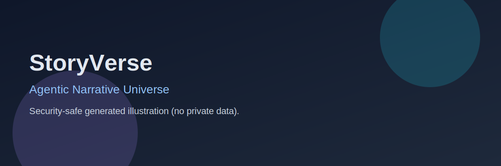
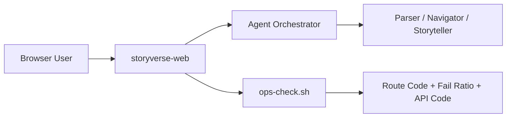

# StoryVerse

<p align="center">
  
</p>

<p align="center">
  <strong>Agentic narrative interface with route-aware operational diagnostics.</strong>
</p>

<p align="center">
  
  
  
</p>

## Overview

StoryVerse is designed to do two jobs simultaneously:

- deliver a high-quality narrative exploration UX (`/`, `/universe`)
- provide precise operational context when real user routes degrade

This dual focus is critical in environments where API health alone can hide actual user-facing instability.

## What’s in this repository

- `storyverse-web/` — primary Next.js application
- parser / navigator / storyteller agent modules
- operational scripts with route/API diagnostics and fallback-aware reporting

## Architecture snapshot



## Why this architecture

- Story UX and operational quality are tracked together, not separately.
- Route-level status and fail ratio expose degraded paths quickly.
- Fallback behavior can be monitored without pretending primary is healthy.

## Developer quickstart

```bash
cd storyverse-web
npm ci
npm run dev
```

Open: <http://localhost:6100>

## Quality gates

```bash
cd storyverse-web
npm run check
```

Includes lint, parser tests, and production build verification.

## Operations workflow

```bash
cd storyverse-web
bash scripts/ops-check.sh
```

Ops report fields include (evolving):

- primary/selected route codes
- endpoint fail counts and fail ratios
- API health code coverage
- latency context per route group

## Roadmap focus

- stronger route-chain diagnostics (edge → proxy → upstream)
- rolling trend metrics for fail ratio and recovery windows
- better degradation classification for alerting and summaries

## Security and privacy

- No credentials in docs or screenshots.
- No private network/internal token references in public outputs.
- Keep operational reports sanitized before broad sharing.

## License

MIT (or project-defined license)
