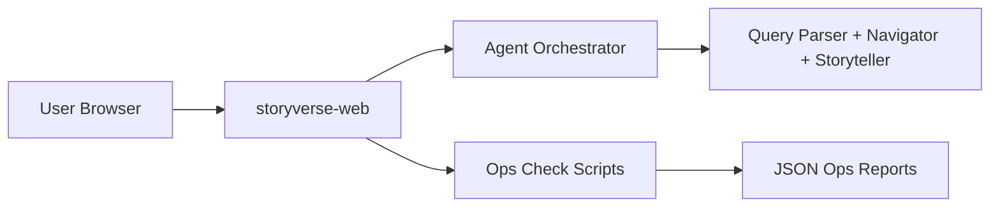

# StoryVerse

<p align="center">
  <strong>Agentic narrative universe explorer</strong><br/>
  A Next.js experience for traversing interconnected story worlds.
</p>

<p align="center">
  
  
  
</p>

---

## Monorepo Layout

This repository currently contains:

- `storyverse-web` — web application (marketing + universe views)

---

## What StoryVerse Does

- Presents a visual, interactive story universe
- Uses agentic orchestration modules for narrative query handling
- Supports production operations checks with route-level diagnostics

---

## Architecture (current)



---

## Quick Start

```bash
cd storyverse-web
npm ci
npm run dev
```

Open: `http://localhost:6100`

Production:

```bash
npm run build
npm run start
```

---

## Quality Gate

```bash
cd storyverse-web
npm run check
```

Runs:
- lint
- parser tests
- production build

---

## Operations & Reliability

The project includes an operations checker with enriched JSON report fields for:
- route-level status codes
- latency
- fail counts and fail ratios
- API health status codes

> Current operating policy can allow fallback while primary route issues are investigated.

---

## Security & Privacy

- Never expose internal credentials in screenshots/docs.
- Keep environment variables out of Git history.
- Prefer sanitized logs in shared channels.

---

## License

MIT (or project-defined license).
