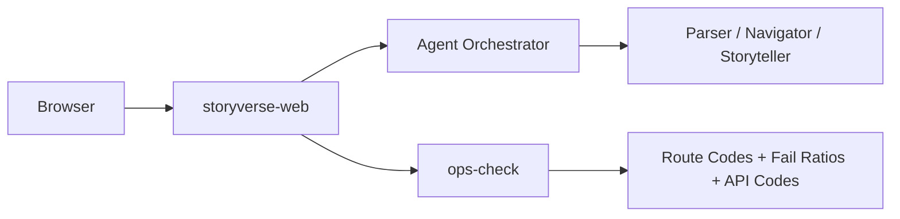

# StoryVerse Monorepo

> **Narrative universe interface where agentic storytelling and operational reliability are engineered together.**


## ◼ Background

Story products often optimize only for experience quality and ignore runtime reliability until incidents happen.  
StoryVerse was started with a deliberate dual-axis model:

- **Axis A: Immersive narrative UX** (`/`, `/universe`)
- **Axis B: explicit route-level operations diagnostics**

This is especially important when API health appears green while public routes degrade.

## ◼ Mission

Deliver a compelling narrative universe frontend that remains operationally transparent under continuous deployment and high-frequency maintenance loops.

## ◼ Vision

StoryVerse aims to become a reusable blueprint for **agentic content systems** where:
- creative modules are composable,
- user-path reliability is measurable,
- fallback policy behavior is auditable.

## ◼ Product Philosophy

- **User-path truth over synthetic health** — real route status matters more than API-only status.
- **Policy-explicit operations** — fallback/strict behavior must be intentional and documented.
- **Narrative quality + SRE quality** — these are one product, not two teams.

## ◼ Repository Scope

Current monorepo app:
- `storyverse-web` — Next.js web client and ops-check pipeline

## ◼ Core Components

| Component | Role |
|---|---|
| `storyverse-web` | Primary user-facing app |
| Parser / Navigator / Storyteller modules | Agentic narrative pipeline |
| `scripts/ops-check.sh` | Route/API status, fail counts, ratios, latency context |

## ◼ Architecture Snapshot



## ◼ Operational Policy Context

The project currently follows a fallback-allowing operational policy (Policy A) under primary-route instability:
- primary degradation is surfaced as warning/degraded,
- fallback success is still captured for continuity,
- strict-fail transitions are policy-controlled, not accidental.

## ◼ Quick Start

```bash
cd storyverse-web
npm ci
npm run dev
```

Open `http://localhost:6100`

## ◼ Quality Gate

```bash
cd storyverse-web
npm run check
```

## ◼ License

MIT (or project-defined license)
