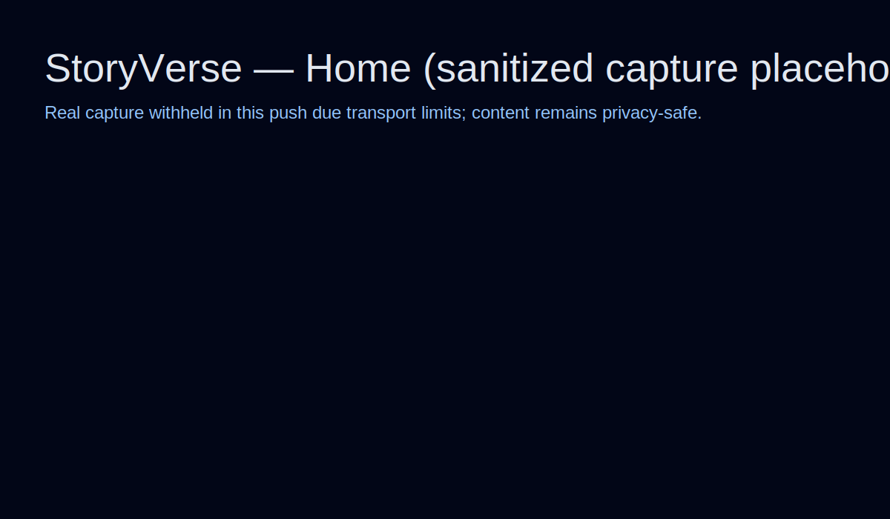
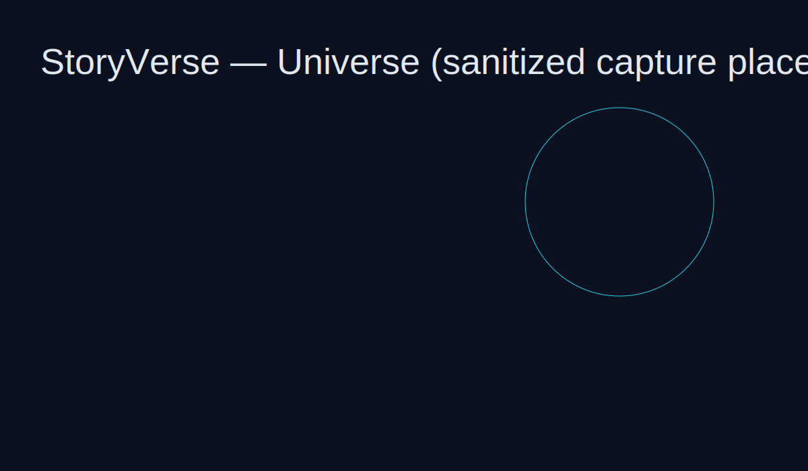

# StoryVerse

Explore interconnected narrative worlds through an agentic web interface.

<p align="center"></p>

## Product Direction

StoryVerse optimizes for both **immersive story UX** and **route-aware operational diagnostics**.

## What’s in this repo

- `storyverse-web`: Next.js app (marketing + universe)
- agent modules: parser / navigator / storyteller
- ops-check with route code, fail ratio, and API health fields

## Screenshots

> Sanitized, privacy-safe placeholders in this commit.




## Developer Quickstart

```bash
cd storyverse-web
npm ci
npm run dev
```

Open <http://localhost:6100>

## Quality Gate

```bash
cd storyverse-web
npm run check
```

## License

MIT (or project-defined license)
