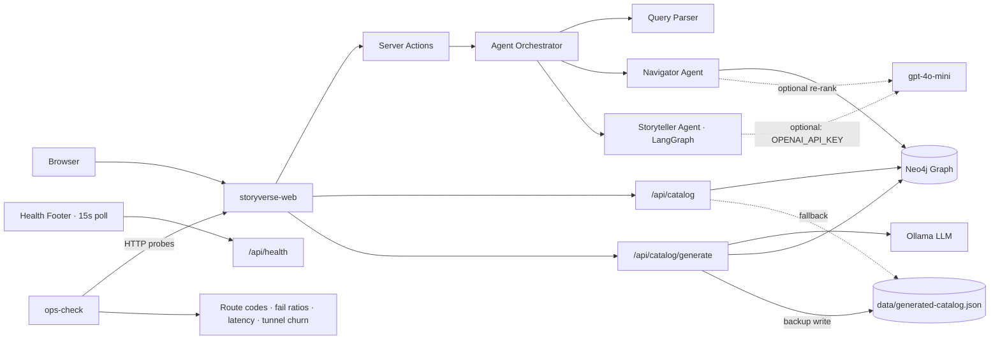

# StoryVerse Monorepo

> **Narrative universe interface where agentic storytelling, visual craft, and operational reliability are engineered together.**


---

## Background

Most story products optimize for either experience quality or runtime reliability, rarely both. StoryVerse was built with a deliberate **triple-axis model**:

- **Axis A — Immersive narrative UX**: A visually rich, modern 2D interface where users explore and connect stories across Movies, History, and Novels through AI-powered narrative bridges.
- **Axis B — Agentic intelligence**: A multi-agent pipeline (Parser → Navigator → Storyteller) that resolves natural-language queries, traverses a Neo4j knowledge graph, and synthesizes cross-domain "What-If" scenarios.
- **Axis C — Operational transparency**: A live health footer, route-level diagnostics, explicit fallback policies, and auditable failure codes — so degradation is surfaced, not hidden.

This matters because API health can appear green while public routes silently degrade. StoryVerse treats narrative quality and SRE quality as one inseparable product.

---

## Mission

Deliver a compelling, AI-driven narrative universe that lets anyone discover hidden connections between the stories that shape our world — while remaining operationally transparent under continuous deployment.

---

## Vision

StoryVerse aims to become a reusable blueprint for **agentic content systems** where:

- Creative modules are composable and domain-portable
- The story catalog grows autonomously through AI generation
- User-path reliability is measurable at every route
- Fallback policy behavior is auditable, not accidental
- Visual design, accessibility, and engineering rigor reinforce each other

---

## Project Philosophy

### Stories are a graph, not a list

Every narrative — whether a Hollywood blockbuster, a pivotal historical event, or a classic novel — exists in relation to others. Characters echo across centuries, power structures recur in new costumes, and moral dilemmas reappear in every genre. StoryVerse makes these invisible threads visible by modeling stories as nodes in a knowledge graph and letting AI synthesize the bridges between them.

### AI as a creative collaborator, not a black box

The system doesn't just "generate text." It decomposes the problem into specialized agents — a **Parser** that understands what the user is asking (in English or Korean), a **Navigator** that traverses the graph for thematic neighbors, and a **Storyteller** that weaves a plausible cross-domain scenario with timeline beats and risk assessment. Each agent's contribution is transparent and individually testable.

### The catalog should grow itself

The initial 8 hand-curated stories are a seed, not a ceiling. StoryVerse includes an AI-powered catalog generator (backed by Ollama) that periodically creates new story entries balanced across domains, persists them to Neo4j (with a JSON file fallback), and makes them immediately available to users. The goal: a living, expanding universe that rewards repeat visits.

### Design is not decoration

The visual layer isn't a skin over functionality — it's part of the product's argument. The dark cosmic theme, domain-specific color coding (Movie blue, History green, Novel pink), glassmorphism cards, and micro-animations all serve information hierarchy and emotional resonance. Every hover glow, gradient border, and timeline dot is a deliberate design decision.

### Every user path deserves a keyboard and a screen reader

Power users get a full shortcut system (search focus, quick filters, history browsing, one-key copy/share actions); assistive-tech users get skip links, live-region announcements, labeled recovery actions, and visible focus states. Neither is an afterthought — recent development has treated accessibility as a shipping feature, commit by commit.

### Ops quality is product quality

A beautiful frontend with silent failures is a broken product. StoryVerse embeds operational diagnostics as a first-class concern: a live health footer that polls the API and flags stale data, route-level status codes, endpoint fail ratios, latency context, and explicit fallback policies. When something degrades, the system tells you — it doesn't pretend everything is fine.

---

## Development Progress

### Completed

| Phase | Description | Status |
|-------|-------------|--------|
| Agentic Pipeline | Parser → Navigator → Storyteller agent chain with Neo4j GraphRAG | Done |
| Query Resolution | Bilingual (EN/KO) natural-language parsing with 5 resolution strategies, confidence levels, and one-click clarification choices (Korean particle-aware) | Done |
| 3D Universe (v1) | Three.js-based 3D visualization with interactive CommandDeck | Done (retired) |
| 2D Redesign (v2) | Complete UX/UI overhaul to modern card-based 2D layout with glassmorphism dark theme | Done |
| Dynamic Catalog | AI auto-generation via Ollama, Neo4j + file persistence, cron-triggerable API endpoint | Done |
| Ops Diagnostics | Route/API status codes, fail ratios, latency metrics, tunnel churn detection | Done |
| **Live Health Footer** | `/api/health` endpoint + footer that polls it every 15s with manual refresh, staleness detection, and screen-reader announcements | **Done** |
| **Universe Command Surface** | Catalog search + medium lane filters, shareable deep links (`q`/`medium`/`source`/`target`), recent bridge pairs, and a page-wide keyboard shortcut system | **Done** |
| **Marketing Quick Nav** | Sticky landing-page section navigator with fuzzy filter, pinned sections, recent trail, and a built-in shortcut guide | **Done** |
| **Accessibility Layer** | Skip links, focusable landmarks, `aria-live` status regions, labeled empty-state recovery actions, visible focus states | **Done** |

### In Progress / Planned

- Neo4j graph seeding automation (`RELATED_TO` relationships for generated stories)
- Story detail pages with full bridge visualization
- Server-side session persistence and favorites (client-side persistence of selections, filters, recent queries/pairs already ships via `localStorage`)
- Multi-language marketing UI (the universe surface is already bilingual EN/KO)

---

## UX/UI Design

### Design System

| Token | Value | Usage |
|-------|-------|-------|
| **Background** | `cosmos-950` (#020617) | Page and card backgrounds |
| **Foreground** | `cosmos-100` (#dbeafe) | Primary text |
| **Panel** | `#0b1228` | Elevated panel surfaces |
| **Muted** | `#8aa0d1` | Secondary text |
| **Accent Cyan** | `neon-cyan` (#22d3ee) | CTAs, source selection, links |
| **Accent Violet** | `neon-violet` (#a855f7) | Target selection, decorative |
| **Accent Rose** | `neon-rose` (#f472b6) | Risk badges, alerts |
| **Domain Movie** | `#60a5fa` | Movie badges, borders, glows |
| **Domain History** | `#34d399` | History badges, borders, glows |
| **Domain Novel** | `#f472b6` | Novel badges, borders, glows |
| **Display Font** | Orbitron | Headings, logos, labels |
| **Body Font** | Space Grotesk | Body text, descriptions |

Supporting tokens: `cosmos` 900/800/700/200 shades, `nebula`/`movie`/`history`/`novel` glow box-shadows, and a faint `space-grid` background pattern.

### Visual Principles

- **Glassmorphism**: Cards use `backdrop-blur-xl` with semi-transparent backgrounds and subtle borders
- **Domain color coding**: Every story is immediately identifiable by its medium through gradient top-borders, colored badges, and themed glow effects
- **Micro-animations**: `fade-in`, `slide-up`, and `float` keyframes for entrance effects and decorative motion (`pulse-glow` and `shimmer` are defined in the design system for future use)
- **Hover dynamics**: Cards scale to 1.02x with domain-colored box-shadows; primary buttons carry a neon glow shadow
- **Constellation motif**: A decorative SVG overlay on the hero page evokes a star-map aesthetic — nodes connected by faint lines, slowly floating

### Homepage (`/`) — 5 Blocks

```
┌─────────────────────────────────────────────┐
│  Header (fixed, glassmorphism nav bar)      │
│  · Skip link · Home/Universe links with     │
│    active state (aria-current)              │
├─────────────────────────────────────────────┤
│  Marketing Quick Nav (sticky command bar)   │
│  · Section progress bar + prev/next/resume  │
│  · Fuzzy section filter (?nav= URL sync)    │
│  · Pinned sections (max 4) + recent trail   │
│  · "?" shortcut guide, keys 1-4 jump        │
├─────────────────────────────────────────────┤
│  Hero Section                               │
│  · Constellation SVG background (animated)  │
│  · Gradient headline: "Explore Stories      │
│    Across Worlds"                           │
│  · Domain badges (Movie / History / Novel)  │
│  · Dual CTA: "Start Exploring" +            │
│    "See How It Works"                       │
├─────────────────────────────────────────────┤
│  How It Works (3 step cards)                │
│  · Pick Two Stories → AI Builds the Bridge  │
│    → Explore Connections                    │
├─────────────────────────────────────────────┤
│  Story Catalog Preview (filterable grid)    │
│  · Medium lane filters synced to ?medium=   │
│  · Per-domain counts + live status text     │
│  · Empty-state "Clear lane filter" reset    │
│  · Click → /universe?story={id}             │
├─────────────────────────────────────────────┤
│  CTA Section + Live Health Footer           │
│  · "Ready to Bridge Worlds?" call-to-action │
│  · API status: live/degraded · fresh/stale  │
└─────────────────────────────────────────────┘
```

### Universe Page (`/universe`) — Split Layout

```
Desktop:
┌──────────────────────────────────────────────┐
│  Header                                      │
├────────────────────┬─────────────────────────┤
│  Story Grid (55%)  │  Bridge Panel (45%)     │
│                    │                         │
│  Search + quick    │  Command Deck header    │
│  filter chips      │  Shortcut guide (?)     │
│  Medium lanes      │  Selected Pair Bar      │
│  [Story Card]      │  Recent Pairs (1-5)     │
│  [Story Card]      │  Query Input + Prompts  │
│  ...2-col grid     │  Clarification Panel    │
│  Empty-state       │  Bridge Result Card     │
│  recovery actions  │  Timeline Beats         │
│                    │  Risk Badge             │
│                    │  Neighbor Suggestions   │
│                    │  Chat History (toggle)  │
├────────────────────┴─────────────────────────┤

Mobile: vertical stack (grid → panel)
State: URL params (q / medium / source / target)
       + localStorage persistence
```

### Component Architecture (Universe)

| Component | Responsibility |
|-----------|---------------|
| `StoryCard` | Domain-colored card with SOURCE/TARGET selection badges, glow states, hover scale |
| `StoryGrid` | Responsive grid with result counts, filter chips, and labeled empty-state recovery actions |
| `SelectedPairBar` | Source → Target display with swap/clear/copy-link/open-link/copy-prompt actions and Generate Bridge CTA |
| `QueryInput` | 240-char query box with starter prompts, recent-query chips, and inline history browsing |
| `BridgeResultCard` | Scenario title + bridge narrative with four copy actions (summary, brief, timeline, next hops) |
| `TimelineBeats` | Vertical timeline with neon dots and staggered fade-in |
| `RiskBadge` | Neon-rose warning card with pulse animation |
| `NeighborSuggestions` | Clickable suggestion cards with domain-colored borders |
| `ClarificationPanel` | One-click corrected prompts (Korean particle-aware) plus source/target candidate pickers |
| `ChatHistory` | Collapsible query log with role filter, text search, and copy-log action |
| `BridgePanel` | Right-side orchestrator composing all bridge sub-components, recent pairs, and the shortcut guide |
| `useUniverseState` | Central state hook: selection, queries, results, recent pairs, and localStorage persistence |

---

## Keyboard Shortcuts

The universe page is fully keyboard-operable. Highlights (press `?` in either surface for the built-in guide):

| Surface | Keys | Action |
|---------|------|--------|
| Universe page | `/` | Focus catalog search |
| Universe page | `1`–`4` | Quick filter picks (Sherlock / galaxy / dynasty / rebellion) |
| Universe page | `A` `M` `H` `N` | Medium lane filter: All / Movie / History / Novel |
| Universe page | `L` / `Shift+L` / `O` | Copy filtered-view link / copy selection link / open in new tab |
| Universe page | `Esc` | Cascade: clear selection → clear filters → blur search |
| Query input | `Ctrl/Cmd+K` | Focus query input (`/` is taken by catalog search on this page) |
| Query input | `Ctrl/Cmd+Enter` | Submit immediately |
| Query input | `↑` `↓` (or `Ctrl/Cmd+P`/`N`) | Browse recent-query history; `Esc` restores the draft |
| Pair bar | `Enter` / `S` / `C` / `O` / `P` | Generate bridge / swap / copy link / open link / copy prompt |
| Result card | `B` / `T` / `N` | Copy full brief / timeline beats / next hops |
| Recent pairs | `1`–`5` | Resume a saved pair (remove/copy/open variants listed in the in-app `?` guide) |
| Landing quick nav | `1`–`4`, `[`/`]`, `/`, `?`, `r`, `f`, `5`–`8`, `9` | Jump sections, filter, resume last stop, pin/recall sections |

## Accessibility

- Skip-to-content links in the root layout and header, targeting a keyboard-focusable `main` landmark
- `aria-current` nav states (including nested routes) and labeled icon buttons throughout
- `aria-live` status regions for: universe result summaries, catalog filter status, query character counter, history-browsing state, and footer health announcements
- `aria-pressed` selection state on filter chips, medium lanes, and clarification candidates
- Labeled empty-state recovery actions and visible `focus-visible` rings on catalog controls
- Decorative SVGs and spinners marked `aria-hidden`; IME-safe Enter handling for Korean input
- **WCAG 2.2 SC 2.1.4**: single-character shortcuts can be turned off via a persisted toggle in the Bridge Panel shortcut guide (the `?` guide and Escape stay active so it's always reachable). Overlapping keys resolve by context — recent-pair slots own their digits, and the page yields `N`/`O` when a result card or selected pair is present, so one keypress never triggers two actions

---

## Architecture


```mermaid
flowchart LR
  User[Browser] --> Web[storyverse-web]
  Web --> Actions[Server Actions]
  Actions --> Orchestrator[Agent Orchestrator]
  Orchestrator --> Parser[Query Parser]
  Orchestrator --> Navigator[Navigator Agent]
  Orchestrator --> Storyteller[Storyteller Agent · LangGraph]
  Navigator --> Neo4j[(Neo4j Graph)]
  Storyteller -.->|"optional: OPENAI_API_KEY"| OpenAI[gpt-4o-mini]
  Navigator -.->|"optional re-rank"| OpenAI
  Web --> CatalogAPI["/api/catalog"]
  CatalogAPI --> Neo4j
  CatalogAPI -.->|fallback| FileStore[("data/generated-catalog.json")]
  Web --> GenerateAPI["/api/catalog/generate"]
  GenerateAPI --> Ollama[Ollama LLM]
  GenerateAPI --> Neo4j
  GenerateAPI -->|backup write| FileStore
  Footer[Health Footer · 15s poll] --> HealthAPI["/api/health"]
  Ops[ops-check] -->|HTTP probes| Web
  Ops --> Metrics[Route codes · fail ratios · latency · tunnel churn]
```

Every external dependency degrades gracefully: without Neo4j the catalog serves the seed + file fallback and the navigator suggests real catalog neighbours (never synthetic nodes, so every suggestion stays selectable); without `OPENAI_API_KEY` the storyteller uses deterministic templates. The storyteller is **grounded** in the navigator's neighbours — the bridge references a real related story rather than an invented one. Low-confidence queries **abstain** — the parser returns a clarification instead of fabricating a bridge. The app boots and demos with **zero** external services configured.

## API Endpoints

| Endpoint | Method | Behavior |
|----------|--------|----------|
| `/api/health` | GET | Liveness + readiness: `ok`, `service`, `version`, `nodeEnv`, `uptimeSec`, `timestamp`, plus `ready` and `checks.neo4j` (a cached, short-timeout Neo4j probe; unconfigured graph is `skipped` and still ready); served with `Cache-Control: no-store` |
| `/api/catalog` | GET | Full story catalog `{ count, catalog[] }` (seed + generated), force-dynamic |
| `/api/catalog/generate` | POST | AI catalog generation; body `{ countPerDomain }` (clamped 1–10, default 4); bearer auth if `CATALOG_GENERATE_SECRET` is set. Required in production — refused when `NODE_ENV=production` and no secret is set; in development, localhost requests are allowed (Host-header check). 60s max duration |

Server actions wrap the agent pipeline with a 15s timeout (timeouts fail fast; other failures get one retry with 150ms backoff), returning explicit failure codes: `EMPTY_QUERY`, `INVALID_SELECTION`, `TIMEOUT`, `EXECUTION_FAILED`.

## Repository Scope

| Component | Role |
|-----------|------|
| `storyverse-web` | Next.js web client, API routes, agent pipeline, ops diagnostics |
| `storyverse-web/src/lib/agents/` | Agentic narrative pipeline (parser, navigator, storyteller, clarification, catalog + generator) |
| `storyverse-web/src/components/` | UI components (universe, marketing, layout, ui) |
| `storyverse-web/scripts/ops-check.sh` | Route/API status, fail counts, ratios, latency, tunnel churn (`npm run ops:check`) |
| `scripts/ops-check.sh` | Root wrapper that runs the web checker and emits a Policy-A JSON summary on success |
| `OPERATIONS_PLAN.md` / `SESSION_MEMORY.md` | Multi-project ops roadmap and session working notes |

Deep-dive docs: [storyverse-web/README.md](storyverse-web/README.md) (implementation and design-system detail) · [storyverse-web/agents.md](storyverse-web/agents.md) (contributor guide for the agent pipeline).

---

## Operational Policy

The project follows a **fallback-allowing operational policy** (Policy A) under primary-route instability:

- `ops-check` probes `/`, `/universe`, and `/api/health` on the primary URL first, then falls back to localhost
- Primary degradation is surfaced as warning/degraded while fallback success is still captured for continuity
- Strict-fail transitions are policy-controlled, not accidental (`OPERATIONS_REQUIRE_PRIMARY` is ignored by design under Policy A)
- Metrics include per-route status codes, fail counts/ratios, health-probe latency, retry totals, and PM2 tunnel restart churn; set `OPERATIONS_REPORT_FILE` for a machine-readable JSON report
- Server action failures return explicit codes: `EMPTY_QUERY`, `INVALID_SELECTION`, `TIMEOUT`, `EXECUTION_FAILED`
- The live footer surfaces health freshness to end users: snapshots older than 20s are labeled stale/over SLA

---

## Quick Start

```bash
cd storyverse-web
cp .env.example .env.local   # optional — every variable is optional
npm ci
npm run dev
```

Open `http://localhost:16100` — no external services are required for a degraded-mode demo (seed catalog + deterministic agents). See [`storyverse-web/.env.example`](storyverse-web/.env.example) for the full configuration surface.

### Environment Variables

| Variable | Required | Description |
|----------|----------|-------------|
| `NEO4J_URI` | Optional | Neo4j connection URI — all three `NEO4J_*` vars must be set to enable graph mode; otherwise the app runs on the seed catalog and the navigator suggests real catalog neighbours |
| `NEO4J_USERNAME` | Optional | Neo4j username |
| `NEO4J_PASSWORD` | Optional | Neo4j password |
| `OPENAI_API_KEY` | Optional | Enables `gpt-4o-mini` bridge narration and suggestion re-ranking; deterministic templates otherwise |
| `OLLAMA_BASE_URL` | For generation | OpenAI-compatible Ollama endpoint, e.g. `http://localhost:11434/v1` (the code default points at an internal lab host — set your own) |
| `OLLAMA_MODEL` | Optional | Ollama model name (default: `qwen3:32b`) |
| `CATALOG_GENERATE_SECRET` | Prod required | Bearer token for the generation API. Required in production (generation is refused when `NODE_ENV=production` and it is unset); in development, localhost requests are allowed without it |
| `QUERY_PREFERRED_MEDIA` | Optional | Comma list: `Movie,History,Novel` — steers ambiguous-query resolution |
| `QUERY_AMBIGUITY_MARGIN` | Optional | Integer `1..40` (default 15) — clarification sensitivity |
| `OPERATIONS_*` | Optional | `ops-check` tuning: base URLs, retries, report file, tunnel process name |

### Generate New Stories

```bash
# Trigger AI catalog generation (4 stories per domain = 12 new stories)
curl -X POST http://localhost:16100/api/catalog/generate

# With custom count (clamped to 1..10 per domain)
curl -X POST http://localhost:16100/api/catalog/generate \
  -H "Content-Type: application/json" \
  -d '{"countPerDomain": 6}'

# Example cron schedule (weekly, Monday 3 AM)
# 0 3 * * 1 curl -X POST http://localhost:16100/api/catalog/generate
```

## Quality Gate

```bash
cd storyverse-web
npm run check       # lint + test:parser + build
npm run ops:check   # live route/API diagnostics
```

`test:parser` compiles the agent library and runs 79 tests (parser, orchestrator, clarification choices, and the action command-runner) on Node's built-in test runner.

## Security

Found a vulnerability? Please report it privately — see [SECURITY.md](SECURITY.md). Note that catalog generation must be locked down with `CATALOG_GENERATE_SECRET` in any deployed environment.

## License

Released under the [MIT License](LICENSE).
